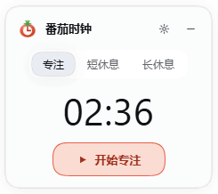
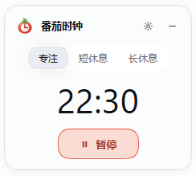
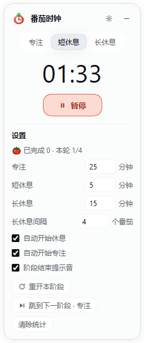
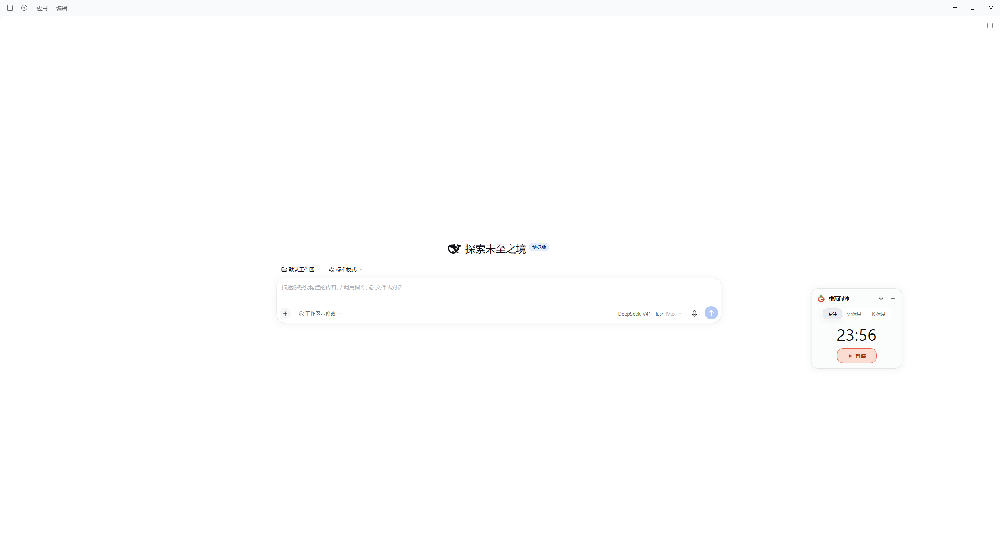
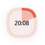
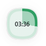
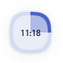
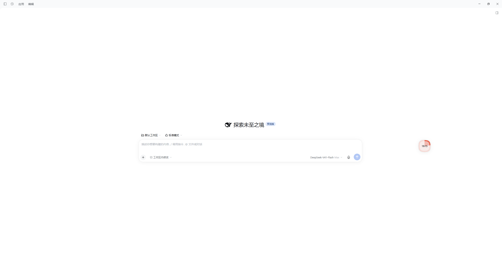

# dsh-pomodoro-clock

> DeepSeek Harness可用的「番茄时钟」插件

Harness Web UI 的**悬浮**专注计时器。挂载在全窗口浮层 `shell.overlay`，有两种形态。休息时还会在**屏幕正中央**浮出一个圆形的**提醒气泡**，气泡里那句话由模型现场生成，生成不出来就回退默认句——见「休息气泡与 AI 提醒语」。


## 面板态

**面板态**（默认停在右下角，四个角为 20px 圆角）：

```
╭──────────────────────────────╮
│ 🍅  番茄时钟            ⚙  — │   ← 整条标题栏可拖动
│                              │
│     ( 专注 )( 短休息 )( 长休息 ) │   ← 阶段胶囊，点击直接切换
│                              │
│            24:44             │
│                              │
│        [ ▶  开始专注 ]        │   ← 浅番茄底 + 番茄描边主按钮
╰──────────────────────────────╯
```

左上角的图标是内联 SVG 画的**番茄钟**，24px。让它像番茄而不是像一颗红蛋，靠三件事：

1. **果实**是一枚略扁的椭圆（横比纵宽），用**径向渐变**从左上高光过渡到边缘深红，再叠一片低透明度的斜向高光，做出"熟透发亮"的观感；
2. **顶部是六片放射状绿萼加一根果蒂**，用上亮下暗的线性渐变。左右两片萼片（x=16.2 / 7.8，y=6.8）伸到了果实顶缘（y=7.0）**之上**，也就是探出果实轮廓外——这是番茄最容易辨认的特征；朝下的两片萼片尖落在表盘范围内，会被表盘干净地盖住，不会在果面上留下突兀的尖角；
3. **表盘**嵌在果实正中，暖白色（`#fff8f2`）而不是纯白，免得在深色卡片上刺眼。

盘面上时针分针固定指向 **15:00**：时针朝右（3 点方向，90°），分针朝上（12 点方向，0°），两针成 90°。












## 圆盘态

**圆盘态**（点 `—` 收起）：62px 圆盘，外环是本阶段进度，中心是倒计时。点一下展开，拖一下移动。









## 休息气泡与 AI 提醒语

进入短休息 / 长休息时，窗口**正中央**浮出一个 **180px 的圆形气泡**，把正在工作的人从屏幕前拉走。气泡里那句话由**模型现场生成**、带当下状态，生成不出来就回退默认句——**没有任何一种失败会让气泡变空或报错**。

- **形态：放大版的圆盘，不是另一个新物件。** 用的是和角落那个 62px 圆盘**同一套 token、同一套结构**——外环走阶段色（已走实心 / 未走淡）、内盘走深一档的两段色、中心是倒计时——只在读数下面多接一句提醒。这样"两个东西在报同一件事"就变成了"同一个东西临时变大"。**角落那个小圆盘照常保留**，它是常驻的那一个。
- **尺寸 180px、环 9px。** 环**没有**按 62px 的比例放大（那会是 15px）：环一粗就变成甜甜圈，视觉重量全跑到环上，40px 的倒计时反而被压住。"样式一致"指的是同一套颜色与结构，**不是同一个比例**——圆盘小所以环相对细，气泡大所以环相对细。
- **不再显示阶段名。** 圆盘本来就没有，阶段由环的颜色表达；重复写一个名字正是原来"挤"和"不好看"的来源。
- **正中央是刻意的取舍。** 它等于压在对话正文和输入框上，在"存在感最强"和"最挡视线"之间选了前者；代价由 ✕ → 小圆点那条退路兜着（点一下就让开）。
- **两行**：剩余时间（40px）/ 一句提醒。剩余时间与卡片、圆盘读的是**同一个 snapshot**，所以秒级 tick 照常刷新它。
- **阶段色是发两次的，别删。** 阶段变量同时写给 `.dsp-pc-root[data-phase=…]` **和** `.dsp-pc-tip[data-phase=…]`：气泡是时钟根节点的**兄弟**（两者都直接挂在整帧浮层里），**兄弟之间不继承自定义属性**。早先只写给根节点，于是气泡里 `var(--dsp-pc-ring, …)` 每次都落到兜底值——三个阶段渲染成同一个颜色，而且完全静默、没有任何报错。
- **进出场**：休息开始时 240ms 淡入 + 轻微缩放；提醒句被替换时那一行单独淡入一次（React 的 `key` 换掉节点）。`prefers-reduced-motion: reduce` 时把动画**整个关掉**（不是缩短）。
- **点 ✕**：气泡收成一个 **30px 小圆点**，挨着圆盘 / 卡片，只显示剩余时间；圆点读同一个 snapshot，数字照常每秒走。**如果这次 ✕ 是键盘（Enter / 空格）按下的**，焦点会跟着落到小圆点上——否则被激活的按钮随气泡一起卸载，焦点掉回 `document.body`，键盘用户得从文档开头重新 Tab 一整圈才碰到唯一的控件（`MouseEvent.detail === 0` 即键盘/辅助技术激活；鼠标点击不动焦点）。
- **点小圆点**：大气泡回来。AI 句已经到了的话，那句提醒还是同一句（不会被打回默认句）；还没到就继续显示默认句，到了再换。
- **休息期间它不会真正消失**：✕ 只是收起。休息结束、或用户切到专注，气泡与小圆点一起消失，进行中的请求同时 abort。
- **不抢输入焦点**：挂载时不 `focus()`，✕ 与小圆点的 `mousedown` 都 `preventDefault`——点它们不会把光标从正在编辑的地方带走。（上面那条键盘路径是**收尾**不是抢：被按的按钮马上要卸载，焦点无主。）
- **点击穿透**：两个节点各是自身尺寸（148×148 / 30×30），浮层其余部分照旧穿透（圆角之外、方块之内的四个角仍会吃掉点击——"只在自己矩形内"的允许范围）。小圆点挂在时钟根节点**内部**（CSS `right:100%`），所以拖动圆盘、在圆盘与卡片之间切换，它都跟着走，不需要任何测量代码。
- **可以不生成**：设置面板里的「AI 生成提醒语」（`aiTip`，默认开）。关掉就完全不发请求，气泡只显示默认句。
- **已知重叠**：气泡固定在**屏幕正中央**，卡片被拖到那一片时会被压在下面，没有做避让。

### 提醒句从哪来

客户端在休息开始时拉一次宿主路由（无状态，状态全在 query 里）：

```
GET /pomodoro/tip?phase=short&round=3&done=7&angle=water&lang=zh
  → 200 {"text":"喝几口水吧，杯子见底就去接满。"}    cache-control: no-store
  → 204 空体                                        其余一切情况
```

**五个参数客户端都会带上，宿主只对 `round` / `done` 硬性要求。** 这两个缺席、空串、非数字，**以及小数或负数**（`round=1.5`、`done=-3`）一律 204，这条是刻意的：`Number(null)` 是 `0`，静默放过去会让模型对一个配置完全正确的用户说「本轮第 0 个番茄」，而 `1.5` / `-3` 这种前提同样是递给模型的假话；三种情况从外面都看不出错。客户端的 `cycleFocus` 起步是 `0`（开机、长休息结束回到专注、长休息中途切到专注、清除统计之后），宿主**接受** `0`（它是合法整数），所以「本轮第 1 个番茄」这个钳制由客户端做（`tipRoundParam`），宿主不替调用方圆场。（`phase` / `angle` / `lang` 有兜底：不认识的角度回退到第一个，非 `en` 的语言按中文处理。）

**`done` 是累计数，不是「今天」。** 客户端发的是 `completedFocus`（设置面板里那个「已完成」，只有「清除统计」才归零），插件里没有按天的维度，所以 prompt 写的是「已完成 N 个（累计）」。跨天不清零时说「今天已完成 12 个」是递给模型的**假前提**，它会顺着这个前提编。

**角度按固定顺序轮换**：`water → distance → walk → stretch → breathe`。客户端自己记「上次用了哪个」（localStorage 键 `dsh.pomodoro-clock.tip.v1`），**发请求之前就落盘**——失败也要往前轮，否则一直 204 的用户会永远停在同一个角度上。这份列表在客户端与宿主**各有一份**（浏览器包 import 不到宿主模块，这是平台的硬边界），`test/tip.test.mjs` 断言两份逐项相等；宿主对不认识的取值一律回退到第一个角度，所以最坏只是某个新角度暂时用不上，不会报错。

**默认句是 i18n 文案**（`tip.fallback`：中「站起来走两步」/ 英 "Stand up and walk a few steps"），不写死在代码里；界面语言随 `lang` 发给宿主。

时间预算：客户端 fetch **3.5 秒**，宿主内部 **3 秒**，两者都会 abort。用户切走时客户端主动 abort，宿主收到请求的 close 也跟着取消，不让调用在后台跑完并计费。

### 失败矩阵：每一条路都回到默认句

| 情况 | 宿主侧 | 气泡 |
|---|---|---|
| `ctx.get('llm')` 拿不到 | 204 + 日志 `no-service:llm` | 默认句 |
| 没配默认模型（`agentDefaultModel.currentSelection()` 缺席） | 204 + 日志 `no-service:agentDefaultModel` | 默认句 |
| 模型抛错 / `stream()` 同步抛错 / 流迭代中抛错 / `text` 不是字符串 | 204 + 对应短码（`stream-threw` / `iteration-threw` / `bad-delta`）；**signal 已 abort 时归到下面那两行**（`timeout` / `client-abort`），因为真实原因是取消，不是网络故障 | 默认句 |
| 清洗后仍不合长度界（空响应、太短、太长、emoji、断口、客套长句） | 204 + 日志 `rejected:<码点>cp/<汉字>han` | 默认句 |
| 终止原因不是 `stop`（`error` / `aborted` / `max-tokens` / `tool-calls`） | 204，已攒的正文**整个丢弃** | 默认句 |
| 流没有终止块（被截断） | 204 + `no-finish`；**abort 导致流提前干净结束时记 `timeout` / `client-abort`**，不是「被截断」 | 默认句 |
| 3 秒没生成完（含适配器用 reject 兑现 `signal` 的情况） | 204 + `timeout`（实测 3042ms / 3032ms 砍掉真实的慢调用） | 默认句 |
| 用户在生成期间切走 / 关页面 | 请求 abort + 日志 `client-abort`（同上：适配器 reject 也算） | 请求已取消；迟到的响应被 `live` 守卫丢掉，气泡不复活 |
| handler 在 `resolveTip` 之外抛出未预料的异常（`ctx.get` 或 `currentSelection()` 抛错、将来在 `writeHead` 之前引入的回归） | 204 + 日志 `handler-threw`（**先留痕再回**；响应已经发出的话不再改状态） | 默认句 |
| 跨站 `Origin`、非法 query（`round=abc`、`round=1.5`、`done=-3`、缺 `done`…） | 204，**不写日志**（这是调用方自己的问题） | ——（客户端只发同源请求） |
| 客户端侧：非 200（含宿主还没加载路由时的 404）、3.5 秒超时、断网、响应体不合形 | —— | 默认句 |

**「回退到默认句」不等于「什么都看不出来」**：宿主每次**生成失败**都会写一行日志（见下节）。而 404（路由没注册）恰恰是**没有日志**的那一种，症状与「生成一直失败」完全一样，排查顺序见「改完之后怎么生效」。

### 排查：AI 句一直不出现

这条路由对外只有两种可见结果：200 带正文，或 204 空体。**生成失败与插件坏掉在 HTTP 上完全同形**，所以失败必须留痕：

```
pomodoro: 休息提醒生成失败，本次回退默认句（timeout）
```

- 括号里是短码与数字（`no-service:llm` / `no-service:agentDefaultModel` / `timeout` / `error:ACCOUNT_SIGN_IN_REQUIRED` / `rejected:37cp/34han` …），**不记模型正文**——生成内容不进宿主日志。
- 两个出口都写：`ctx.logger.warn` 与 `console.warn`。实测（web profile）：cordis 的 Logger 存在、`warn` 是可调用的函数、调用成功，但**没有任何注册过的 exporter**，消息哪儿都不出现；同一次实验里 `console.warn` 直接出现在宿主进程的输出里，所以它才是当前唯一确认有落点的通道。两个都写，是为了不依赖 profile 的日志配置。
- 先看这一行，**别先怀疑路由没注册**；反过来，如果日志里什么都没有，才轮到怀疑宿主进程里跑的还是旧模块（见「改完之后怎么生效」）。

### 隐私边界：发给模型的只有数字

`phase`（阶段）、`round`（本轮第几个番茄）、`done`（累计完成数）、`HH:MM`（**宿主进程**的本地时间，客户端不参与）、`angle`（这次的角度）、`lang`（语言）。

**不含任何对话内容、文件内容或工作区路径**，prompt 模板里也没有。请求体里不传 `purpose`，`maxTokens` 是 60。

### 两条不能含糊的限制

1. **这条路由没有自己的鉴权。** 具名路由在 webserver 的 fallback **之前**分发——`GET /` 的 401 来自 fallback 里对 index 的鉴权，不是一道全局闸门（对照：`/nope.js` 是 404 而不是 401，未注册的路径由 fallback 自由应答）。所以 `Origin` 检查（缺席放行、跨站与解析不出的 `Origin` 一律 204）是它**唯一**的访问控制，**不能称之为「已鉴权」**。它挡得住跨站脚本读这个接口，**挡不住 DNS rebinding**（攻击者把自己的域名解析到 `127.0.0.1`，`Origin` 与 `Host` 就同源了）。把 `dsh web` 暴露到局域网，别人可以打这个路由烧 token——虽然它无状态、只读、不碰任何用户数据，最坏就是借你的额度生成一句提醒。要根治得用宿主自己的 Host 白名单（`connection.requestRejection`），本插件没有引入。
2. **借用了应用内部的 API。** `GenerateOptions.purpose` 只接受 `compaction | session-title`，没有给插件留位置，所以插件**不传**它；但这说明这套接口的设计意图是应用内部使用，**将来 DSH 改这个接口，插件可能会坏**。同类的还有一处：3 秒切断依赖适配器遵守 `signal`（`resolveTip` 自己不 race 迭代），碰上一个完全不理会 `signal` 的适配器，请求会挂到客户端 3.5 秒放弃。

### 一条踩得很贵的坑：`reasoningEffort` 必须显式发 `'off'`

计划原本写的是「不传 `reasoningEffort`，让适配器用它自己的默认」——**这是反的**。适配层的默认档是 `high`，而思考型模型会先吐满整整 60 个 token 的 `reasoning-delta`（把 `maxTokens` 全吃光），随后以 `finish{kind:'max-tokens'}` 收尾，**一个 `text-delta` 都没有**；fail-closed 的闸门于是正确地返回 `null` → **永远 204**，从外面看与「插件坏了」完全同形。这是本功能最贵的一个 bug。

现在请求里显式带 `reasoningEffort: 'off'`（DSH 自己的 `session-title` 单行生成用的也是它）。万一当前默认模型不认这个档（llm 的能力校验跑在**派发之前**，会以终止性 `finish{kind:'error'}` + `UNSUPPORTED_REASONING_EFFORT` 结束、不发真实请求），`resolveTip` 会**去掉这个字段重试一次**：采纳标准一点没松（第二次同样必须拿到 `finish{kind:'stop'}`），而 `max-tokens` / `aborted` / 无终止块**不重试**（去掉字段只会让推理回来，更糟）。两次尝试共用同一个 3 秒期限，重试不会把它翻倍。**重试的白名单里只有 `UNSUPPORTED_REASONING_EFFORT` 这一个码**：auth 失效 / 额度用尽 / 限流 / 网络故障一律不重试——那些失败换一份请求体照样失败，第二枪只是白烧一次**真实计费**的请求（早期实现是「任何 error 都重试」，与这句话不符，整支评审收窄了它）。测试里有一条专门钉 `reasoningEffort === 'off'`——修复前那条断言写的是「不许出现这个字段」，正好把正确的修复判成了失败。

## 交互

| 控件 | 行为 |
|---|---|
| 标题栏 / 圆盘 | 拖动移动。位置按浏览器记住，并始终钳制在窗口内。 |
| `—` | 收起为圆盘。 |
| 点圆盘 | 重新展开面板。 |
| 阶段胶囊 | 切到「专注 / 短休息 / 长休息」，并**停住**——要真正开始得再按一次「开始」。各阶段的进度互不干扰：切走时会记住剩余量，切回来续上。悬停标签可以看到该阶段的时长。方向键 ← → 只移动焦点，Enter / 空格才提交。 |
| `▶ / ❚❚` | 开始或暂停当前阶段。 |
| `⚙` | 在当前卡片内展开设置面板。 |
| 圆盘圆环 | 本阶段进度，**按阶段换色**：已走过的一段是实心阶段色，未走过的一段是同色低透明度版本。见下节。悬停可见百分比。 |
| 主按钮 | **浅番茄底 + 深番茄字 + 番茄描边**，随明暗主题自动换色，见下节。 |
| 气泡右上角 `✕` | 收起为 30px 小圆点（只显示剩余时间，数字照常走）；休息期间不会真正消失。见「休息气泡与 AI 提醒语」。 |
| 小圆点 | 展开回大气泡，那句提醒还是刚才那句。**鼠标点一定可以**；Tab 到它再按 Enter / 空格走的是浏览器原生的 `<button>` 键→click 往返，**只有真浏览器能证**，见「未验证」。 |

番茄循环是标准节奏：一个专注阶段之后是短休息，每完成第 *n* 个（默认 4）专注阶段改为长休息；**长休息期间「本轮」停在 n/n**，等长休息结束、下一轮专注真正开始时才归零（原因见下）。

### 为什么「本轮」只在 0/4 ~ 3/4 之间跳

早先的版本是这样：第四个专注结束的那一刻，`cycleFocus` 先加一到 4，紧接着被清零。

```js
if (fromFocus) state.cycleFocus += 1                       // 3 → 4
const long = fromFocus && state.cycleFocus >= longEvery    // 4 >= 4 → true
if (long) state.cycleFocus = 0                             // ← 同一个同步块里立刻归零
```

**4 这个值只存在了零毫秒**——写进去马上被覆盖，中间没有任何一次渲染能观察到它。于是 `本轮 X/4` 的分子在结构上永远够不到分母，读数只有 `0/4 1/4 2/4 3/4`，看起来像"永远完不成一轮"。

问题不在状态机算错了，而在**清零的时机早了一个阶段**：

| | 叙事 |
|---|---|
| 旧逻辑 | 专注×4 → **本轮 0/4**（这轮"没了"）→ 长休息 |
| 现在 | 专注×4 → **本轮 4/4**（这轮成了）→ 长休息（奖励）→ 长休息结束 → 新一轮 0/4 |

长休息本身就是"这轮完成了"的兑现，在它期间显示 0/4 会把那点成就感抹掉。现在清零挪到**进入下一个专注时**。

**一个容易漏掉的坑**：清零不能只写在"长休息走完"那一处，因为用户可以在长休息中途点 Tab 直接切到专注，而那条路走的是 `switchPhase()`，**根本不经过 `completePhase()`**：

```js
switchPhase(phase) { … state.phase = phase … }   // 完全不碰 cycleFocus
```

漏了这一处，`cycleFocus` 会在长休息中途切走时卡在 `longEvery` 上，接着 `nextPhase` 算成 `4+1 >= 4` 显示"跳到长休息"，而且那个专注结束后**又是一个长休息**——此后每次专注都跟着长休息。所以归一化写在**两条路的汇合处**：只要进入专注阶段就收掉满计数。测试里这两条路各有一条守卫。


设置面板里包含：三档时长（分钟）、长休息间隔（1–12）、自动开始休息 / 自动开始专注 / 阶段结束提示音、已完成番茄数与本轮进度，以及三个次要操作 —— **重开本阶段 / 跳到 XXX / 清除统计**。其中「跳到……」会直接写出目标阶段（「跳到长休息」「跳到短休息」「跳到专注」），按之前就知道会去哪；跳过的专注阶段**不计入**番茄数。


## 圆环的阶段配色

圆盘（收起态）里只有一个倒计时数字加一圈环——**没有任何文字**说明当前是哪个阶段。所以环色是那个形态下唯一能承载阶段信息的地方，三个阶段共用一个颜色就等于放弃了它。

一开始确实三个都是番茄色，后来按下面的依据分开：

| 阶段 | 浅色 | 深色 | 色相 |
|---|---|---|---|
| 专注 | `#e8604a` | `#f0705a` | 8.4° |
| 短休息 | `#2f9e63` | `#4cc38a` | 148.1° |
| 长休息 | `#4a63c8` | `#8b9df0` | 228.1° |

**挑色的唯一硬指标是色相距离**——环只有 3px 粗、还压在卡片背景上，色相挨得近就分不出来。实测两两间隔 139.75° / 79.99° / 140.26°。

两个被否掉的候选，以及原因：

- **琥珀**（`#f0a020`）：和番茄只差 **28.6°**，恰恰是最难分开的一对。它的吸引力来自交通灯的红/琥珀/绿三色——但交通灯能成立是因为三盏灯在空间上分开、时间上轮流亮，不是因为红和琥珀好区分；而且交通灯里琥珀的语义是"即将变化"，长休息不是警告。
- **深绿**（`#1c6b52`）：和短休息绿只差 **12.9°**，比琥珀还近。想靠明度差区分的话，在 3px 细环上比色相差更不可靠。

**已知短板**：红和绿是红绿色觉障碍（约 8% 男性）最难分的一对，所以"专注 ↔ 短休息"这一对靠颜色解决不了，靛蓝只帮到了长休息。要彻底解决需要非颜色的冗余通道（盘内阶段字、或环上一个缺口刻度），目前刻意没做。

配色的明暗两套值由 `PALETTE` 直接生成两条 CSS 规则写进插件自己的 `<style>`（见下节），不再经过主题服务。**"未走过"那段没有用 `color-mix()` 现算**——后者一旦不被支持，整条 `conic-gradient` 会失效、圆环直接消失；写成显式 token 没有这个风险。

### 配色不走 `overrideTokens`，自带调色板

`ctx.theme.overrideTokens()` 是宿主给插件的正规扩色入口，但这个插件**不用它**。原因是踩了一次很贵的坑：

**覆盖层注册得成功，值却到不了 DOM。**

实测证据：

```js
// Theme.listTokens 里 16 个 --dsp-pc-* token 一个不少 —— 说明注册成功了
// 但：
getComputedStyle(document.body).getPropertyValue('--dsp-pc-ring-short')  // → ""
getComputedStyle(document.querySelector('.dsp-pc-root')).getPropertyValue('--dsp-pc-ring')  // → ""
```

于是 `--dsp-pc-ring` 解析失败，三个阶段**全部回退到兜底色**。而这个故障是确定性的：反复关开插件、强制刷新模块代际都不解决。

推断（未能证实）是负责把 token 写进 DOM 的 presenter 拿不到含本插件覆盖层的 theme 快照——要么它在另一个客户端实例上，要么只在挂载时读一次快照。

**修法不是绕过它，而是不再需要它**：把 16 个色值直接生成进自己注入的样式表。

```js
const paletteDecls = (mode) => Object.entries(PALETTE).map(([n, p]) => `${n}:${p[mode]}`).join(';')
// 浅色 → .dsp-pc-root{…}
// 深色 → body[data-ds-dark-theme] .dsp-pc-root{…}
```

关键是**原子性**：色值和消费它们的规则在同一个样式表里。样式表在，颜色就在；样式表不在，整个部件都是裸的。**两者不可能再脱节**——而脱节正是这次的全部问题。

两个实现要点：

1. **深色规则只覆盖原始色值，绝不重新声明 `--dsp-pc-ring` / `--dsp-pc-dial`。** 它的选择器是 `(0,2,1)`，而阶段规则 `.dsp-pc-root[data-phase=…]` 是 `(0,2,0)`；一旦在深色里也写映射变量，深色主题下的阶段会被**永久钉死在 focus**。自检里有一条专门钉这个。
2. `body[data-ds-dark-theme]` 是宿主 layout presenter 维护的暗色属性，宿主自己的主题 CSS 用的也是它。

代价：这 16 个 token **不再出现在 `Theme.listTokens` 里**（不再经过主题服务注册），可发现性下降。换来的是"它不可能再悄悄失效"。

**兜底仍然保留**（见下节）：自带调色板让故障几乎不可能发生，但兜底让"万一发生"时一眼可见。

### 圆盘中间必须是不透明实色

圆盘中间那两层（已走过 / 未走过）的 token **必须写成不带 alpha 的实色**。这不是风格偏好，是踩过的坑。

最早的实现是"整块圆盘铺满 conic-gradient，再用一个圆片把中间盖住"，而那个圆片的背景借用了宿主的 `--dsw-specific-menu`。问题在于它是**磨砂面板填充**，不是实心板——宿主自己从来都配着 `backdrop-filter` 用：

```css
background: var(--dsw-specific-menu);
backdrop-filter: var(--dsw-menu-backdrop-filter);   /* blur(40px) saturate(150%) */
```

而它的透明度**随平台变**：同一个名字在主题包里有两套定义，一路链到 `--dsw-menu-surface-fill` 的 alpha 是 58%（浅）/ 45%（深），另一路是 94%。macOS 桌面版走偏透的那套（系统支持原生 vibrancy，填充就该给薄），于是底下 conic-gradient 的扇形有 40% 以上透上来，在圆盘中间留下一块**太浅、分不出**的残影；Windows 上那个值恰好够实，把它压到几乎看不见——**所以这个问题在 Windows 上开发时根本看不到**。

三个可复用的结论：

1. **"磨砂材料"不能当遮罩用。** 一个 token 的名字和用途说明它是盖在内容上的薄膜，就不该拿它去挡东西。宿主从不这么用。
2. **诊断这类问题的关键是"有没有合成"。** 出问题的中间区域是"半透明覆盖 + 底下渐变"的合成结果；外圈是直接涂的纯色描边，所以只有中间出问题。纯色背景的合成在任何引擎上都一样，**唯一能变的只有那个 alpha 值**——这就排除了"引擎渲染差异"，锁定为"值随平台变"。
3. **同一个 token 既做卡片底又做中间遮罩，在构造上就不可能成功**——同材料的圆片挡不住同材料的底。

现在中间的六个值是独立的明暗双值 token，两层都带阶段色相（所以阶段刚开始、扇区接近 0° 时中间也不会变成没颜色），层次是**外圈最深 → 中间已走过 → 中间未走过**。

### 兜底色不能用阶段色

圆环和中间那两层的 `var()` 兜底**刻意不写阶段色**：

```css
background: conic-gradient(
  var(--dsp-pc-ring, var(--dsw-alias-state-error-primary)) …,
  var(--dsp-pc-ring-soft, var(--dsw-alias-state-error-primary)) 0)
```

早先兜底是 `#e8604a`（番茄色），结果踩了一次很贵的坑：**页面处于半更新状态时，主题调色板覆盖层被移除却没重新注册**，所有 `var(--dsp-pc-ring-*)` 解析失败，三个阶段全部回退成番茄色——一个**看起来完全合理**的画面。于是"全都变番茄了"被当成配色问题，在 CSS 和主题实现里查了好几轮，最后发现**根因根本不在源码里**，强制重刷模块代际就好了。

教训是：**兜底值如果长得像某个合法状态，它就会把故障伪装成正常。** 现在：

- 外圈兜底用宿主的**错误色**——故障时是**红环**，而红不是任何阶段色。仍在显示说明部件活着，是红的说明这是错误态；两段共用同一兜底色，顺带让进度也失效。
- 中间兜底用**不透明中性面板色**（`--dsw-alias-bg-overlay`）——故障由红环负责报警，中间保持中性，倒计时文字仍可读。

顺带一条排障经验：**颜色类输出"整体不对"时，先怀疑运行时状态，别读代码。** 顺序是 ① 关掉再打开插件强制刷新模块代际 ② 重启 DSH ③ 还不行再读代码。这次把顺序做反了。

**仍未处理**：外圈"未走过"那段用的还是 `rgba(...,0.22)`，它同样叠在圆盘那层平台相关的磨砂底上——同一类问题，只是幅度小得多，肉眼看不出，暂未改动。

## 主按钮的配色

原来是"反色实心"（`--dsw-alias-label-primary` 做底、`--dsw-alias-bg-base` 做字）：深色主题下白底，**浅色主题下就是纯黑**。黑色在整张卡片里是最重的一块，比 24px 的倒计时还抢眼，视线会先落到按钮而不是时间上；而且卡片其余部分早就是番茄一家人了，只有它是外人。

现在改成浅番茄族。**关键约束是浅底必须配深字**——浅番茄配白字对比度只有 **1.43:1**，完全不可读：

| | 底色 | 字色 | 对比度 |
|---|---|---|---|
| 浅色主题 | `#fbdcd3` | `#a0301c` | **5.55:1** ✓ |
| 深色主题 | `#4a1d12` | `#ffc9bb` | **9.71:1** ✓ |
| （反例）| `#f8cfc4` | `#ffffff` | 1.43:1 ✗ |

描边（浅色 `#e8604a` / 深色 `#a8442c`）负责把"这块可以点"补回来：浅色主题下按钮比卡片还浅，没有描边容易被读成次要操作甚至禁用。

两套色不是靠代码判断主题实现的：`PALETTE` 里的每一对 `{ light, dark }` 由 `paletteDecls()` 摊成两条 CSS 规则——浅色挂在 `.dsp-pc-root`、深色挂在 `body[data-ds-dark-theme] .dsp-pc-root`。插件里不需要知道当前是明是暗，宿主也不需要知道这个插件存在。为什么不用 `overrideTokens` 见上文。


## 为什么切 Tab 会停住

一个自然的疑问：专注跑到一半，点「短休息」为什么不直接开始倒计时？这里刻意没有那样做，理由有三条。

**1. Tab 在所有人的直觉里是导航，不是提交。** 让导航型控件承担破坏性操作是错配——三个胶囊挨在一起、字号 12px，误触一次就可能让 25 分钟的专注进度无提示归零。

**2. 那会绕过用户自己的设置。** `autoStartBreak` / `autoStartFocus` 的语义是"**阶段结束后**要不要自动开始下一个"。点 Tab 让休息立刻开跑，等于在一条没有"阶段结束"事件的路径上自动开始了休息：用户把 `autoStartBreak` 关掉，本意是"不要自动开始休息"，却在这个入口被绕过去了。关掉一个开关却在别处被绕过，是这类不一致里最难发现的。

**3. 方向键会连环提交。** 早期实现里 ArrowLeft/Right 既移动焦点又调用切换，在 tablist 里按两下方向键就会连着两次改写计时状态，最后停在一段已经在跑的 15 分钟长休息上——一次纯导航手势产生两次破坏性写入。现在方向键只移动焦点，Enter / 空格才提交（ARIA 的"手动激活"模式：自动激活适合廉价的视图切换，不适合会改状态的提交）。

代价是"我现在就要休息"变成两次点击。换来的是：没有任何阶段会在你没按「开始」的情况下开跑，`autoStartBreak` 的语义重新变得干净。

**各阶段进度互不干扰。** 离开一个阶段时，它已走剩下的部分会被记进 `stash`，回来时续上（仍是暂停态）。所以"想知道短休息几分钟 → 点一下看看 → 点回来"这个动作不会白白丢掉已经专注的时间。只有**真正走过一部分、又没走完**的阶段才会留下续跑点；完整未动的阶段切回来本来就是完整时长，不必存。

续跑点的清理规则是这套机制唯一需要小心的地方，一共六个出口：阶段自然走完（同时清掉走完的那个和刚进入的那个）、按「重开本阶段」、按「清除统计」、计时归零后重新开始、以及时长被改短时夹回上限。少了任何一个，都会出现"上一轮剩下的 3 分钟"在下次进入该阶段时莫名冒出来。续跑点跟着持久化，所以刷新页面后还在。


## 为什么跳过也遵循周期

`completePhase` 里原本是这样写的：

```js
if (fromFocus && options.count === true) {
  state.completedFocus += 1   // ① 统计：真正完成了几个番茄
  state.cycleFocus += 1       // ② 周期：现在该短休还是长休
}
```

而「跳过」传的是 `count: false`。本意只针对 ①——跳过的阶段不该算一个完成的番茄，这是对的；但它**顺带把 ② 也冻住了**，于是 `cycleFocus` 永远停在原位，`cycleFocus >= longEvery` 永不成立。

后果不只是"少了一条路径"。把长休息间隔设成 **1**（这个配置下短休息根本不该存在），实测：

| 专注的结束方式 | 进入的阶段 |
|---|---|
| 自然走完 25:00 | 长休息 |
| 按「跳过」 | **短休息** ← 一个按周期规则不该出现的状态 |

**统计计数**和**周期位置**是两件事，绑在同一个开关上是设计失误。现在拆开了：

- `completedFocus` —— "真正完成了几个番茄"，只有自然走完才算，跳过不虚报；
- `cycleFocus` —— "本轮已经完成了几个专注"，专注阶段无论怎么结束都往前推一格；取值范围是 `0..longEvery`（长休息期间停在 `longEvery`，进入下一轮专注时才归零）。

同一个根因还导致**补算**（页面关闭期间走完的阶段）也不推进周期——离开几小时回来，周期位置还是走之前那样。现在一并修好：补算推进周期，但仍然不计入番茄数（用户当时并不在）。

按钮文案也不再自己复刻周期规则：`computeSnapshot()` 提供 `nextPhase`，设置面板直接显示它。测试里有一项专门比对"预告"与 `skip()` 的真实结果，在 5 种长休间隔、2400 步随机游走中必须完全一致——所以这个按钮的文案不可能说谎。


## 行为说明

- **整个窗口只有一个时钟。** 行注册在 root 作用域的 `shell.overlay` 上，不随会话切换重建，也不按会话重复出现。
- **不会挡住界面。** 浮层本身是 `pointer-events:none`，只给直接子元素放行事件 —— 所以部件严格等于自身盒子大小，周围区域照常可以点击。
- **按墙钟计时。** 存的是截止时刻 `endsAt` 而不是递减计数，所以不会累积误差，刷新页面后落在墙钟真正对应的阶段上。页面关闭期间走完的阶段最多静默补算 8 个且**不计入**番茄数；更长的空档视为过期运行，重置为全新的专注阶段。
- **页面关着时提示音不会响**，下次加载时补算。
- **跟随主题。** 只使用宿主的 token（`--dsw-*` 与插件自己的 `--dsp-pc-*`；浮起表面与投影沿用宿主自己的 `--dsw-specific-menu` / `--dsw-elevation-soft`，均带 token 兜底），因此明暗主题与主题覆盖都会自动生效。不引入任何 Harness Client 包，React 取自浏览器模块表。
- **中英双语。** 文案通过 `ctx.locale` 注册在 `pomodoro` 命名空间下，切换语言实时跟随。
- **键盘可达。** 圆盘可聚焦，Enter / 空格展开；所有控件都是真正的 `button`，并带无障碍名称。
- **AI 提醒语可以关。** 设置面板里的「AI 生成提醒语」默认开；关掉完全不发请求。宿主拿不到句子时（204、404、超时、断网）是同一个结果：气泡照常出，只显示默认句。


## 文件

| 文件 | 作用 |
|---|---|
| `package.json` | bundle 清单：`dsh.bundle.patch` 与 `dsh.client`（`platform: web`）。 |
| `cordis.patch.yml` | 插入 `pomodoro-clock` 行的 bundle 层。 |
| `index.js` | Host 半边：`apply` 注册无状态的只读路由 `/pomodoro/tip`（休息提醒句的生成与回退）。计时的状态机与全部界面都在浏览器侧。 |
| `client.js` | 浏览器 bundle：模型、悬浮部件、休息气泡、设置面板、样式、语言包。注释为中文。 |
| `test/*.mjs` | 两个无依赖的断言脚本：`model.test.mjs`（计时模型）、`tip.test.mjs`（宿主半 + 两组客户端纯函数），`node --run test` 依次跑。 |
| `icon.svg`、`locale/*.json` | 插件管理卡片的图标与显示文本。 |


## 安装与卸载

已作为 bundle `@local/pomodoro-clock` 装在 `desktop` profile，通过 `link:` 指向本目录 —— 改这里的文件，下一次加载就会读到。可在**设置 → 插件**里启停，或用 `plugin_manager` 的 `install_bundle` / `remove_bundle`。


## 改完之后怎么生效

**两个半边不一样，改哪边看哪条。**

- **客户端半（`client.js`）**：对宿主来说它就是"已构建的浏览器产物"——宿主编排 Loader 行时对文件做快照，所以仅仅保存文件不会进入已经打开的页面。要么在**设置 → 插件**里把插件关掉再打开（这一步会让宿主丢弃缓存记录并重新读取文件），要么**重启 DSH**；**只刷新页面不行**，宿主仍会返回它已缓存的快照。
- **宿主半（`index.js`）**：**必须重启宿主进程。** Node 的 ESM 按解析后的 URL 缓存模块，宿主进程在启动时 import 一次本文件；插件管理器的 disable→enable 只是重新组合 loader entry，`Entry.init()` 的 import 命中缓存、**不会重新求值**它。DSH 的 HMR 在本 profile 里是 `root: []`（不监听模块文件），也别指望热重载。症状极隐蔽：entry 是 `active`、没有任何报错，而 `/pomodoro/tip` 一直 404（旧版宿主半的 `apply` 是空函数），于是 AI 句永远回退默认句。这不是推测：在 disable→enable 之间往这个文件加一条模块级副作用，副作用没有触发、路由依旧 404。

**当前现场（判断"AI 句为什么不出现"时先看这里；以下是 2026-10-07 19:09 的快照，宿主进程一重启就作废）：** 当时桌面端那个宿主进程 PID 5700 启动于 **13:08**，而宿主半的代码 **15:03** 之后才落盘——它里面跑的还是空 `apply()`。2026-10-07 19:09 实测（`curl.exe`，不带 Origin）：`GET /pomodoro/tip?…` → **404**；对照 `GET /` 仍是 401、`/nope.js` 仍是 404。**重启宿主进程之前，AI 句不可能出现**（客户端把 404 和 204 一样当回退处理，气泡照常出、只显示默认句，不会报错）。判断方法：`netstat -ano | findstr :19387` 看 PID 有没有换过。


## 测试

```sh
node --run test        # = node test/model.test.mjs && node test/tip.test.mjs
```

（`node --run` 需要 Node 22+；装了 npm 的环境里 `npm test` 完全等价。）

`test/model.test.mjs` 不启动浏览器：它按标记把纯计时模型从 `client.js` 里切出来，注入可控时钟和内存版 `localStorage`，然后像真实使用那样驱动它——开始、走时、切换阶段、跳过、刷新。覆盖两类踩过坑的语义：

**各阶段的续跑点**：切走再切回要续上（12:30 而不是从 25:00 重来）、续上后仍是暂停态、完整未动的阶段不留存档、**休息中途切走再跑完不会把残留的 3:00 带到下一次**（最易错的一条）、重开本阶段清存档、刷新后存档仍在、清除统计作废全部、时长改短后夹到上限。

**长休息周期**：跳过遵循周期（`longEvery = 1` 时跳过专注必须进长休息）、跳过不虚报番茄数、自然走完仍计数、补算推进周期但不计数、周期位置随刷新持久化，以及**「预告」与 `skip()` 的真实结果在 5 种长休间隔、2400 步随机游走中完全一致**——这保证「跳到 XXX」按钮的文案不可能与实际行为不符。另有两条守卫钉住"本轮"计数的归零时机：**长休息走完进入下一个专注时才归零**，以及**长休息中途用 Tab 切到专注也归零**（后者绕开 `completePhase`，漏了会导致此后每次专注都紧跟一个长休息）。

`test/tip.test.mjs` 同样不启动浏览器、不发网络请求：它直接 `import` 宿主半 `index.js` 的具名导出（prompt 构造、清洗、校验、生成编排、同源判定），用假 `llm` 与假 `ctx` 把失败矩阵逐条走一遍（含 `reasoningEffort: 'off'` 与那次收窄后有上限的重试）；**HTTP 映射也在里面**——最后一组用假 `ctx` / 假 `req` / 假 `res` 装载**真实的** `apply` 与 `handleTip`，钉住 `200 + {"text"} + cache-control: no-store`、五条 204 出口（跨站 `Origin`、非法 query、`llm` 缺席、默认模型缺席、`resolveTip` → null）与 `handler-threw` 的留痕；内部 3 秒期限留了 `deps.timeoutMs` 接缝，单测用 50ms 就能证明「期限真的会砍掉慢调用」（生产路径不传接缝，默认仍是 3000ms）。另有**四组**客户端纯函数——角度轮换 `nextAngle`、小圆点的按键归属 `miniRootKeyDown`、✕ 的键盘激活判定 `tipCloseFromKeyboard`、`round` 的 0 → 1 钳制 `tipRoundParam`——按 `// --- tip-angle / tip-key / tip-focus / tip-round ---` 标记从 `client.js` 里切出来求值。**气泡组件的渲染与接线在仓库里仍没有自动化覆盖**（浏览器包 import 不了），那部分只有仓库外的一次性冒烟与人工目视，见「验证状态」。

改动 `index.js` 或 `client.js` 的纯逻辑部分后请跑一遍 `node --run test`；只改注释和文档不用跑。测试靠字符串标记定位切片：如果标记变了导致切不出来、或切出来的片段混入了渲染代码，它会**直接抛错**，而不是静默测到错的东西。


## 验证状态

**一条命令就能复现的**

- `node --run test`（= `node test/model.test.mjs && node test/tip.test.mjs`）：退出码 **0**，**40/40 + 105/105 = 145 项断言全过**。
  - `test/model.test.mjs`（40 项）：把纯计时模型从 `client.js` 里切出来（并断言切片**不含** `React` / `document` / `createElement`），注入可控时钟与内存版 `localStorage` 后跑真实状态机。
  - `test/tip.test.mjs`（105 项）：宿主半的纯逻辑与全失败矩阵——prompt 构造（含「累计」口径与中英两条长度界的完整表述）、`sanitizeTip`、`validateTip` 的中英长度界、`resolveTip` 的每条回退路径（含 `reasoningEffort: 'off'`、收窄后的重试白名单、可注入的内部期限、abort 引起的失败按 signal 归类）、`isSameOrigin`，以及**用假 ctx/req/res 驱动真实 `apply`/`handleTip` 的路由契约组**（200 + no-store、五条 204 出口、`handler-threw` 留痕、`req` close → abort）；另有四组按标记从 `client.js` 切出来求值的纯函数：`nextAngle`、`miniRootKeyDown`、`tipCloseFromKeyboard`、`tipRoundParam`。全部无网络、无浏览器。
- `node --check` 通过：`index.js`、`client.js`、`test/*.mjs`；`package.json`、`locale/zh.json`、`locale/en.json` 用 `JSON.parse` 可解析。
- **静态事实**（读文件即可复核；数字是 2026-10-07 这份树的）：中英两个字典各 **33 个键**、逐项对齐且键序一致（`locale/*.json` 的 2 个 meta 键同样对齐）；**30 个 class 键**全部出现在样式表里，也没有未定义的 `CLASS.*` 引用；样式表用到的 **32 个自定义属性**全部是插件自己的 `--dsp-pc-*`（21 个）或宿主的 `--dsw-*`（11 个）——**一个 `--dsh-*` 也没有**（气泡改用屏幕居中后，原先定位用的 `--dsh-frame-overlay-top` 已不再需要）；注释语言：按"以 `//` 开头，或以 `*` 开头且该行不只有 `*` / `/`（即**排除只有 `*`、`*/` 的纯标记行**）"统计，`client.js` **321** 行、`index.js` **263** 行注释，其中不含中文的只有 **14 / 9** 行（空的 `//` 分隔行、`// --- tip-angle / tip-key / tip-focus / tip-round ---` 四种切片标记各自的起止两行、JSDoc 的纯类型签名行）。

**本次功能用过、但脚本不在仓库里（新克隆复现不了）**

- **浏览器包的整机冒烟**：用 `new Function` 载入真实的 `client.js`，配假 `window` / `document` / `fetch` / `Date` 与一个约 120 行的迷你 React（修复轮 6 起它也给宿主节点接 `ref` 与 `focus()`，用来观察焦点去哪了），装载真实的 `apply` 与真实组件树。脚本是 `%TEMP%\pomodoro-smoke.mjs`（临时文件），2026-10-07 修复轮 6 后复核 **54/54 通过**。它覆盖：气泡出现与三行文案、请求 URL 五个参数齐全（含 `cycleFocus=0` 时发 `round=1`）、200 替换默认句、204 与"迟到响应"保持默认句、✕ ↔ 小圆点往返、鼠标点 ✕ 不动焦点而键盘按 ✕ 把焦点交给小圆点、圆点随 tick 走、圆盘态下圆点仍在、切到专注时 abort、语言切换重发、`aiTip` 关掉 0 次请求、小圆点上的 Enter 不被根节点抢走。它用的是假 DOM 与自写迷你 React，**证明不了真实 DOM、真实 React 与真实浏览器行为**。
- **仓库外的 HTTP harness**（`..\.scratch-asar\`，不提交）：`tip-route-harness.mjs`（假 ctx + 真 `node:http`，37 项）与 `tip-e2e.mjs`（真 cordis + 真 webserver + 真端口，装载提交版 `index.js`，14 项）。2026-10-07 复核：e2e **14/14 通过**；route harness **35/37**——两条失败是**脚本自己**的旧断言（断言请求里不许出现 `reasoningEffort`、断言 prompt 写「今天已完成 7 个」），与现在的实现正相反，不是产品失败。这恰好说明仓库外的脚本当不了回归网；那两条契约从修复轮 6 起改由**仓库内**的路由契约组（`test/tip.test.mjs` 最后一组）守着。
- **实机端到端**（由控制器在**新起的宿主进程**上做：`dsh --profile web --no-open --port 19588`）：zh 200 `{"text":"喝几口水吧，杯子见底就去接满。"}`、en 200、同一条请求 6/6 采样 200（933–2120 ms）、跨站 `Origin` 204、`round=abc` 204、缺 `done` 204、`GET /` 401、`/nope.js` 404；慢调用被 3 秒期限砍断（**204 @3042ms / 3032ms**，日志短码 `timeout`）；另有「截断 → `finish:max-tokens`」与「provider 不存在 → `error:NO_ADAPTER`」两条 204 + 日志。**那个进程已经关掉**，而桌面端这个进程（PID 5700，13:08 启动）里是旧模块：2026-10-07 19:09 实测 `GET /pomodoro/tip?…` 仍是 **404**（对照 `/` 401、`/nope.js` 404）。所以上面这些数字在**重启宿主进程之前**无法复现——这不是功能坏了，是缓存，见「改完之后怎么生效」。

**更早的自检（脚本同样未入库，不能一条命令复跑）**——下面这些数字来自当时的一次性脚本，判断规则都写在对应注释里，可以手工复核：

- 图标几何自检：果实/高光/绿萼/果蒂/表盘/时针/分针 7 个元素齐备；时针指向 90.0°、分针指向 0.0°、两针夹角 90°，即**正好 15:00**；时针 3.1、分针 4.5，都短于表盘半径 5；表盘与果实同心且完全落在果实内；高光不越出果实边界（7.02 < 7.79）；绿萼解析出 12 个顶点即 6 片萼片，左右两片在果实顶缘之上、朝下两片的尖端到表盘圆心 4.48 < 5 会被盖住；果蒂顶端（2.6）高于所有萼片尖（3.16）；内容在 24×24 viewBox 内且居中。
- 圆盘配色自检：外圈两段都走 `var(--dsp-pc-ring…)`，**不残留任何写死的颜色**（上一版正是把"未走过"那段写死成 `rgba(232,96,74,.22)`，才导致换色换不动）；中间两层走 `var(--dsp-pc-dial…)`，且**必须是不带 alpha 的实色**。
- 两个文件共用几何：`icon.svg` 与卡片内图标的果实、表盘、高光、绿萼路径、果蒂、时针、分针 7 项数值逐项一致。
- 主按钮配色自检：调色板 4 个 token 都给了 light/dark 一对；浅色 **5.55:1**、深色 **9.71:1**，都过 WCAG AA 4.5:1；作为对照，浅番茄配白字实测 **1.43:1**，确认不可用；CSS 里三个属性的兜底色值与调色板 `light` 一列逐项一致；旧的 `opacity:.88` hover 写法与反色实心写法都已移除。
- 自带调色板自检（23 项全过）：把 CSS 求值出来验结构（括号平衡、45 条规则形状合法）；**16 个浅色值和 16 个深色值逐个断言确实写进了样式表**（这次故障的核心就是"注册了但没写进 DOM"）；**深色规则断言不得重新声明四个映射变量**——它是 `(0,2,1)`，阶段规则是 `(0,2,0)`，写错会让深色主题下的阶段被永久钉死在 focus；断言可执行代码里**不再出现 `overrideTokens` / `ctx.get('theme')`**；三个阶段色相判读仍为番茄/绿/靛蓝。
- 阶段配色自检：三个 `data-phase` 值都有映射规则；色相距离 139.75° / 79.99° / 140.26° 全部达标，并把两个被否掉的候选作为**反例断言**钉住（琥珀 28.6°、深绿 12.9°，都判为不合格）。
- 圆盘构造自检（30 项全过）：调色板 16 个 token 明暗齐备；**六个中间色两端都是 6 位 hex 实色**（专门挡住"再写回 rgba"）；中间规则里**不再出现 `--dsw-specific-menu`、也不含任何 `rgba(`**；三个阶段都映射了中间变量；外圈保持不变；中间两层与外圈**同色相**（偏差 ≤3°）；浅色主题的层次为外圈 0.26 < 已走过 0.69 < 未走过 0.89。
- 兜底色自检（17 项全过）：把 CSS 求值出来查结构（括号平衡、44 条规则形状合法）；**四个颜色兜底逐个断言"不是调色板里任何一个阶段色"**，并确认外圈兜底是错误色（故障可见、不消失）、中间兜底是不透明中性色（不伪装成专注阶段）；两条反例断言钉住旧写法（`#e8604a` 与 `rgba(232,96,74,…)` 都不许再出现在兜底位置）。
- 实时（历史观察）：Client 曾报告该条目为 `shell.overlay` 中胜出且未被淘汰的 occupant（`order: 5`），说明 `apply` 执行完毕、部件渲染未抛错。这条来自当时的一次 inspect 查询，现在无法从仓库复跑。

**未验证（需要人眼 / 真机）**

- **一切视觉结果**：180px 泡里**倒计时（40px）与提醒句（11px）的排版余量**、环 9px 的粗细是否合适（太粗会像甜甜圈）、内盘两段色在明暗主题下的层次、`--dsp-pc-dial` 那两段**不透明实色**与 `--dsw-alias-label-secondary` 提醒句的对比度、✕ 有没有露在圆外、30px 圆点里 9px 的数字是否够清楚、**正中央压住正文和输入框是否可接受**（这是刻意的取舍，不可接受就退回中上方）；以及原有的间距、token 对比度、拖动手感。本环境没有浏览器控制能力，无法代替你确认"看起来对不对"。
- **真实交互**：不抢输入焦点、键盘按 ✕ 后焦点落到小圆点（假 DOM 冒烟里 `ref`/`focus()` 是自写的，真实浏览器的事件 `detail` 与焦点规则要人眼/真机验一次）、点击穿透、拖动圆盘时小圆点跟随、真浏览器里 Enter 触发小圆点的原生 click、`prefers-reduced-motion` 的实际表现——冒烟测试用的是假 DOM，这些只有真浏览器能证。
- **真实浏览器里的一次完整往返**：客户端那一侧只被桩 fetch 覆盖过，宿主路由那一侧是被 `curl.exe` 覆盖过的，两边合起来的"点开一次休息 → 气泡拿到 AI 句"没有仓库内的记录。
- **气泡与卡片重叠**：气泡固定在**屏幕正中央**，卡片被拖到那一片时会被压在下面，没有做避让。
